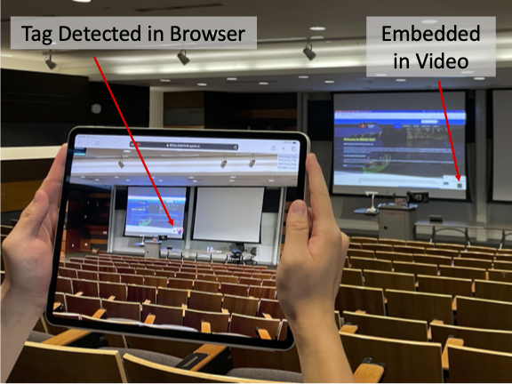

# FLASH

FLASH is a system for delivering AR content to large public spaces like concert stadiums and sporting arenas. It embeds active (blinking) tags into existing video displays, like jumbotrons, allowing smartphones to accurately determine their pose from long distances. Paired with our web-browser-based detection algorithm, FLASH allows delivery of AR content to the masses even in challenging environments with dynamic lighting and staging. We show that our technique outperforms similarly sized passive tags in terms of range by 20-30% and is fast enough to run at 30 FPS within a mobile web browser on a smartphone.



The FLASH detector detects modulated LEDs to anchor AR content as described [here](http://users.ece.cmu.edu/~agr/resources/publications/FLASH_ISMAR_2021.pdf).
This repository will lead to a more lightweight implementation, able to run in a browser, using WebAssembly.


Based on [apriltag](https://github.com/AprilRobotics/apriltag).

# Building

1. Make sure you have **opencv** installed if you want to compile the opencv examples.
2. Make sure you have **emsdk** and **npm** installed if you want to compile to wasm.
3. Clone this repo (with ```--recurse-submodules```).
4. Compile with npm:
```
npm run build
```
